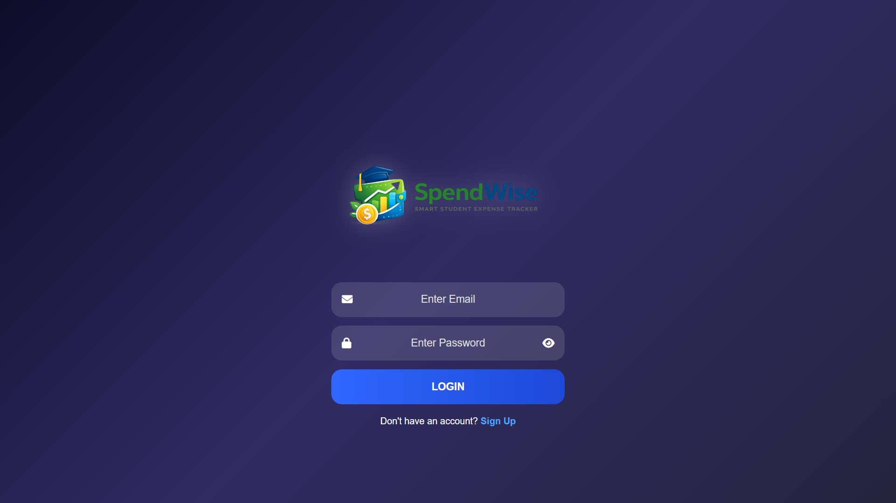
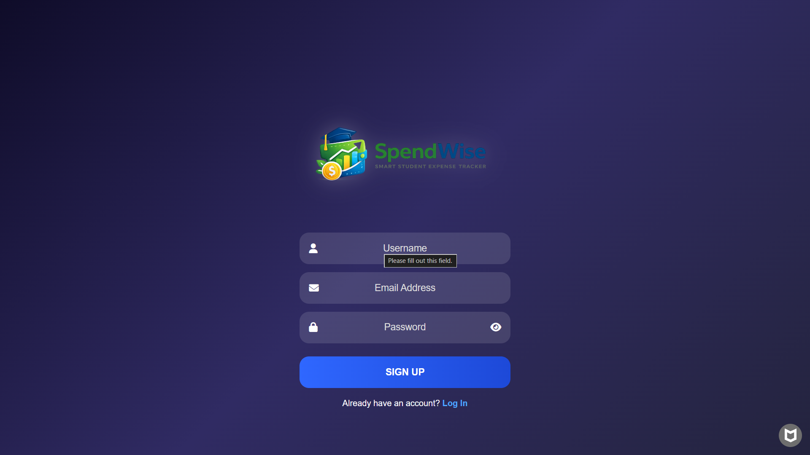
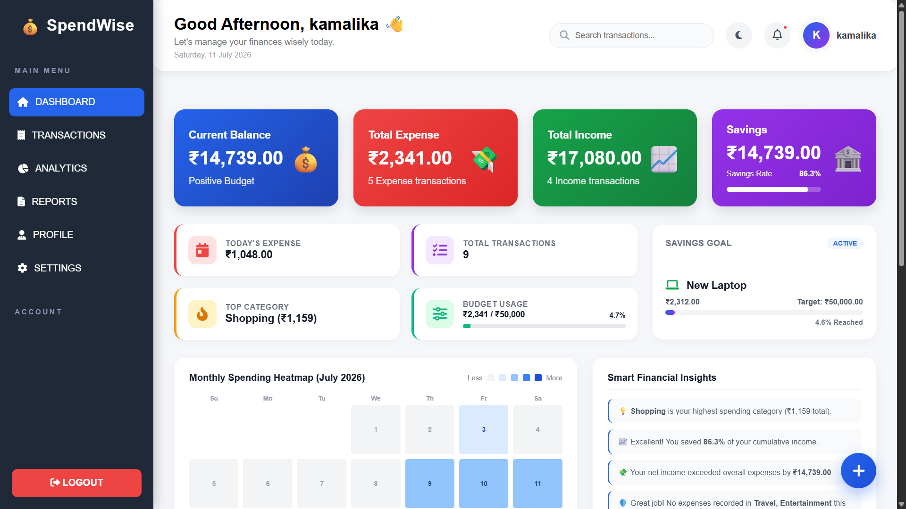
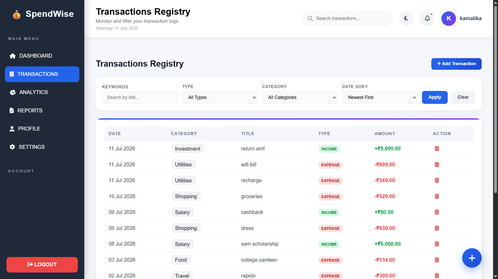
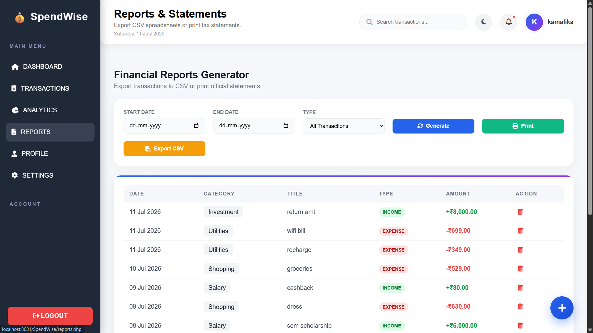
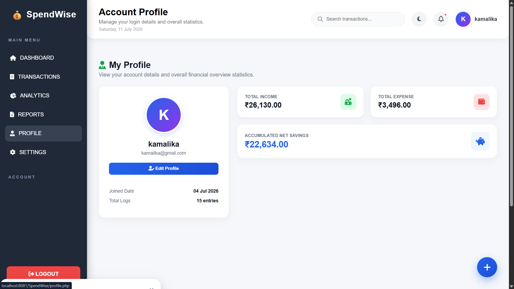
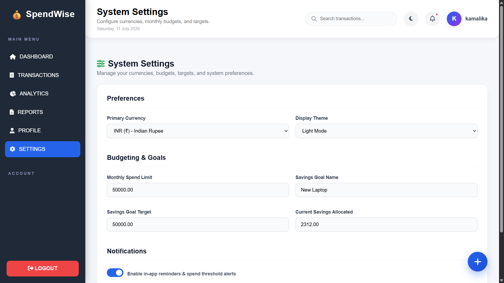
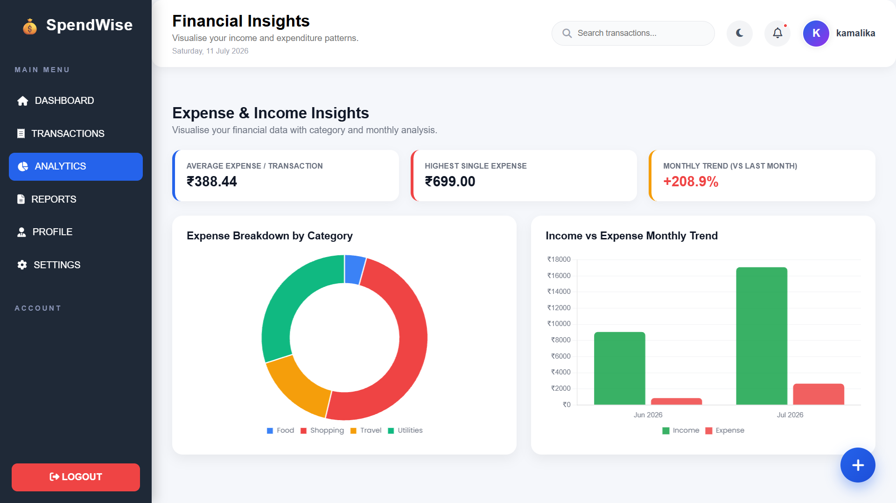
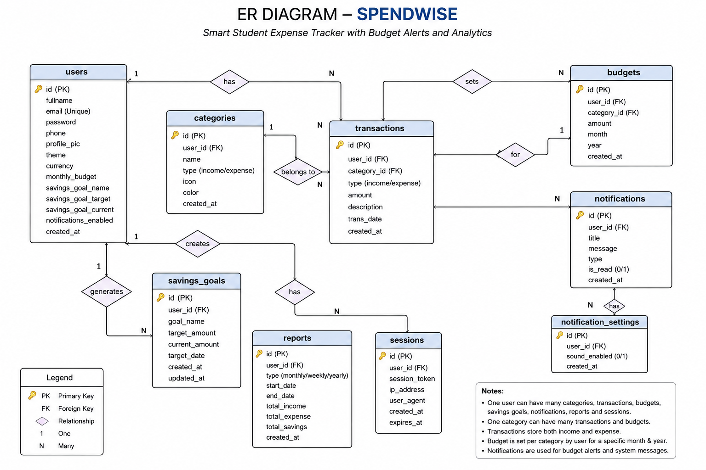
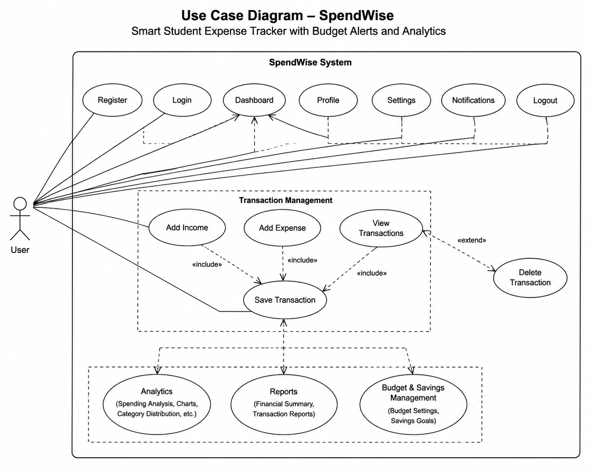

# 💰 SpendWise – Smart Student Expense Tracker with Budget Alerts and Analytics

<p align="center">
  
</p>

<p align="center">
  <b>A modern full-stack web application that helps students manage their personal finances with smart budgeting, expense tracking, savings monitoring, and interactive analytics.</b>
</p>

<p align="center">


</p>

---

# 🌐 Live Demo

### 🔗 Website

**http://spendwise.byethost10.com**

### 📂 GitHub Repository

**https://github.com/kamalikasenthilnaathan09/SpendWise-Smart-Student-Expense-Tracker-with-Budget-Alerts-and-Analytics**

---

# 📖 Project Overview

Managing personal finances is an essential skill for students, yet many rely on manual calculations or scattered notes to track their expenses.

**SpendWise** is a smart expense management web application that enables students to:

- Track income and expenses
- Monitor savings
- Manage budgets
- Analyze spending habits
- View financial reports through interactive charts

The project focuses on providing a clean, responsive, and user-friendly interface while ensuring secure authentication and efficient data management.

---

# ✨ Key Features

## 🔐 User Authentication

- Secure User Registration
- Secure Login
- Session Management
- Logout Functionality

---

## 💰 Expense Management

- Add Income
- Add Expenses
- Edit Transactions
- Delete Transactions
- Transaction History

---

## 📊 Dashboard

- Current Balance
- Total Income
- Total Expenses
- Total Savings
- Financial Summary Cards
- Monthly Overview

---

## 📈 Analytics

- Expense Analysis
- Income vs Expense
- Monthly Spending Trends
- Interactive Charts
- Financial Reports

---

## 🔔 Smart Notifications

- Budget Alerts
- Expense Notifications
- Savings Updates

---

## 👤 User Profile

- Update Profile
- Account Information
- Personalized Dashboard

---

## ⚙️ Settings

- Theme Preferences
- Currency Selection
- User Preferences

---

# 📸 Application Screenshots

## 🔐 Login Page



---

## 📝 Registration Page



---

## 📊 Dashboard



---

## 💸 Transactions



---

## 📈 Reports



---

## 👤 Profile



---

## ⚙️ Settings



---

## 📊 Expense Analysis



---

## 🗄️ ER Diagram



---

## 🎯 Use Case Diagram



---

# 🛠️ Technology Stack

## Frontend

- HTML5
- CSS3
- JavaScript
- Bootstrap
- Font Awesome
- Chart.js

---

## Backend

- PHP

---

## Database

- MySQL

---

## Development Tools

- Visual Studio Code
- XAMPP
- phpMyAdmin
- Git
- GitHub

---

## Deployment

- ByetHost

---

# 📂 Project Structure

```
SpendWise
│
├── assets/
│   ├── css/
│   ├── js/
│   └── images/
│
├── includes/
│
├── screenshots/
│   ├── analysis.png
│   ├── dashboard.png
│   ├── er_diagram.png
│   ├── login.png
│   ├── profile.png
│   ├── reports.png
│   ├── settings.png
│   ├── signup.png
│   ├── transaction.png
│   └── usecase_diagram.png
│
├── analytics.php
├── dashboard.php
├── db.php
├── delete.php
├── index.php
├── login.php
├── logout.php
├── notifications.php
├── profile.php
├── reports.php
├── save_transaction.php
├── settings.php
├── signup.php
├── transactions.php
├── Dockerfile
├── PROJECT_DETAILS.md
└── README.md
```

---

# ⚙️ Installation Guide

## 1️⃣ Clone Repository

```bash
git clone https://github.com/kamalikasenthilnaathan09/SpendWise-Smart-Student-Expense-Tracker-with-Budget-Alerts-and-Analytics.git
```

---

## 2️⃣ Move Project

Copy the project folder to

```
xampp/htdocs/
```

---

## 3️⃣ Create Database

Create a MySQL database named

```
spendwise
```

Import

```
spendwise.sql
```

---

## 4️⃣ Configure Database

Update `db.php`

```php
$host = "localhost";
$user = "root";
$password = "";
$database = "spendwise";
```

---

## 5️⃣ Start XAMPP

Start

- Apache
- MySQL

---

## 6️⃣ Run Application

Open

```
http://localhost/SpendWise/
```

---

# 🚀 Live Deployment

The project is successfully deployed online.

🌐 **Live Website**

**http://spendwise.byethost10.com**

---

# 📊 Modules

- User Authentication
- Dashboard
- Expense Tracking
- Income Tracking
- Transaction Management
- Reports
- Analytics
- Notifications
- Profile Management
- Settings

---

# 🎯 Future Enhancements

- 🤖 AI Spending Prediction
- 📱 Android Application
- ☁ Cloud Synchronization
- 📄 PDF Report Export
- 📧 Email Notifications
- 🔍 Smart Search
- 🎤 Voice Expense Entry
- 🧾 OCR Receipt Scanner
- 📊 Advanced Analytics Dashboard

---

# 💡 Project Highlights

✅ Responsive Design

✅ Interactive Dashboard

✅ Modern User Interface

✅ Secure Authentication

✅ MySQL Database

✅ CRUD Operations

✅ Financial Reports

✅ Interactive Charts

✅ Mobile Friendly

✅ Live Deployment

---

# 📚 Learning Outcomes

Through this project, I gained practical experience in:

- Full Stack Web Development
- PHP & MySQL Integration
- CRUD Operations
- Session Management
- Database Design
- Data Visualization using Chart.js
- Responsive UI Development
- Git & GitHub
- Web Application Deployment
- Debugging and Troubleshooting

---

# 👩‍💻 Developer

## Y S Kamalika

**B.Tech – Artificial Intelligence & Data Science**

Passionate about

- Artificial Intelligence
- Full Stack Web Development
- Data Science
- Machine Learning
- Problem Solving

---

# 📬 Connect With Me

### GitHub

https://github.com/kamalikasenthilnaathan09

### LinkedIn

*(Add your LinkedIn profile URL here.)*

---

# ⭐ If you like this project

Please consider

⭐ Starring the repository

🍴 Forking the project

💬 Sharing your feedback

---

# 📄 License

This project was developed for educational, learning, and portfolio purposes.

© 2026 Y S Kamalika. All Rights Reserved.
